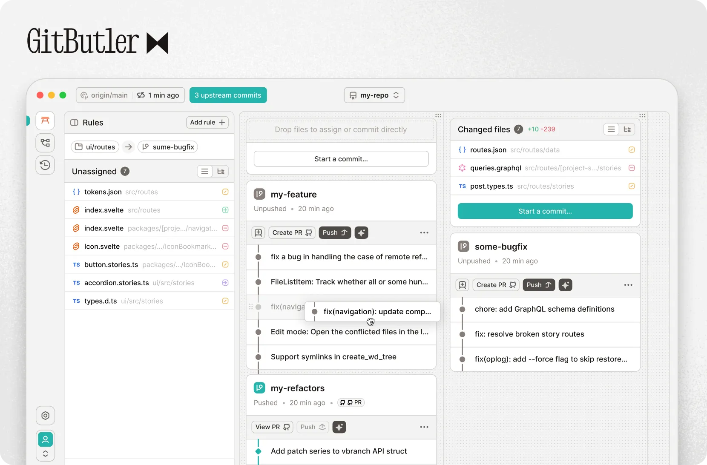

  

   
   

  

    Version Control tool built from the ground up for modern, AI-powered workflows.
     
     
    <a href="https://gitbutler.com">Website</a>
    &nbsp;&nbsp;•&nbsp;&nbsp;
    <a href="https://blog.gitbutler.com/">Blog</a>
    &nbsp;&nbsp;•&nbsp;&nbsp;
    <a href="https://docs.gitbutler.com/">Docs</a>
    &nbsp;&nbsp;•&nbsp;&nbsp;
    <a href="https://gitbutler.com/downloads">Downloads</a>
  

[![TWEET][s1]][l1] [
![BLUESKY][s8]][l8 ] [![DISCORD][s2]][l2]

[![CI][s0]][l0] [![INSTA][s3]][l3] [![YOUTUBE][s5]][l5] [![DEEPWIKI][s7]][l7]

[s0]: https://github.com/gitbutlerapp/gitbutler/actions/workflows/push.yaml/badge.svg
[l0]: https://github.com/gitbutlerapp/gitbutler/actions/workflows/push.yaml
[s1]: https://img.shields.io/badge/Twitter-black?logo=x&logoColor=white
[l1]: https://twitter.com/intent/follow?screen_name=gitbutler
[s2]: https://img.shields.io/discord/1060193121130000425?label=Discord&color=5865F2
[l2]: https://discord.gg/MmFkmaJ42D
[s3]: https://img.shields.io/badge/Instagram-E4405F?logo=instagram&logoColor=white
[l3]: https://www.instagram.com/gitbutler/
[s5]: https://img.shields.io/youtube/channel/subscribers/UCEwkZIHGqsTGYvX8wgD0LoQ
[l5]: https://www.youtube.com/@gitbutlerapp
[s7]: https://deepwiki.com/badge.svg
[l7]: https://deepwiki.com/gitbutlerapp/gitbutler
[s8]: https://img.shields.io/badge/Bluesky-0285FF?logo=bluesky&logoColor=fff
[l8]: https://bsky.app/profile/gitbutler.com

 

GitButler is a git client that lets you work on multiple branches at the same time.
It allows you to quickly organize file changes into separate branches while still having them applied to your working directory.
You can then push branches individually to your remote, or directly create pull requests.

In a nutshell, it's a more flexible version of `git add -p` and `git rebase -i`, allowing you to efficiently multitask across branches.

## How Does It Work?

GitButler keeps track of uncommitted changes in a layer on top of Git. Changes to files or parts of files can be grouped into what we call virtual branches. Whenever you are happy with the contents of a virtual branch, you can push it to a remote. GitButler makes sure that the state of other virtual branches is kept separate.

## How Do GB's Virtual Branches Differ From Git Branches?

The branches that we know and love in Git are separate universes, and switching between them is a full context switch. GitButler allows you to work with multiple branches in parallel in the same working directory. This effectively means having the content of multiple branches available at the same time.

GitButler is aware of changes before they are committed. This allows it to keep a record of which virtual branch each individual diff belongs to. Effectively, this means that you can separate out individual branches with their content at any time to push them to a remote or to unapply them from your working directory.

And finally, while in Git it is preferable that you create your desired branch ahead of time, using GitButler you can move changes between virtual branches at any point during development.

## Why GitButler?

We love Git. Our own [@schacon](https://github.com/schacon) has even published the [Pro Git](https://git-scm.com/book/en/v2) book. At the same time, Git's user interface hasn't been fundamentally changed for 15 years. While it was written for Linux kernel devs sending patches to each other over mailing lists, most developers today have different workflows and needs.

Instead of trying to fit the semantics of the Git CLI into a graphical interface, we are starting with the developer workflow and mapping it back to Git.

## Tech

GitButler is a [Tauri](https://tauri.app/)-based application. Its UI is written in [Svelte](https://svelte.dev/) using [TypeScript](https://www.typescriptlang.org) and its backend is written in [Rust](https://www.rust-lang.org/).

## Main Features

- **Virtual Branches**
  - Organize work on multiple branches simultaneously, rather than constantly switching branches
  - Automatically create new branches when needed
- **Easy Commit Management**
  - Undo, Amend and Squash commits by dragging and dropping
- **Undo Timeline**
  - Logs all operations and changes and allows you to easily undo or revert any operation
- **GitHub Integration**
  - Authenticate to GitHub to open Pull Requests, list branches and statuses and more
- **Easy SSH Key Management**
  - GitButler can generate an SSH key to upload to GitHub automatically
- **AI Tooling**
  - Automatically write commit messages based on your work in progress
  - Automatically create descriptive branch names
- **Commit Signing**
  - Easy commit signing with GPG or SSH

## Example Uses

### Fixing a Bug While Working on a Feature

> Say that while developing a feature, you encounter a bug that you wish to fix. It's often desirable that you ship the fix as a separate contribution (Pull request).

Using Git you can stash your changes and switch to another branch, where you can commit, and push your fix.

_With GitButler_ you simply assign your fix to a separate virtual branch, which you can individually push (or directly create a PR). An additional benefit is that you can retain the fix in your working directory while waiting for CI and/or code review.

### Trying Someone Else's Branch Together With My Work in Progress

> Say you want to test a branch from someone else for the purpose of code review.

Using Git trying out someone else's branch is a full context switch away from your own work.
_With GitButler_ you can apply and unapply (add / remove) any remote branch directly into your working directory.

## Documentation

You can find our end user documentation at: <https://docs.gitbutler.com>

## Bugs and Feature Requests

If you have a bug or feature request, feel free to open an [issue](https://github.com/gitbutlerapp/gitbutler/issues/new),
or [join our Discord server](https://discord.gg/MmFkmaJ42D).

## AI Commit Message Generation

Commit message generation is an opt-in feature. You can enable it while adding your repository for the first time or later in the project settings.

Currently, GitButler uses OpenAI's API for diff summarization, which means that if enabled, code diffs would be sent to OpenAI's servers.

Our goal is to make this feature more modular such that in the future you can modify the prompt as well as plug a different LLM endpoints (including local ones).

## Contributing

So you want to help out? Please check out the [CONTRIBUTING.md](CONTRIBUTING.md)
document.

If you want to skip right to getting the code to actually compile, take a look
at the [DEVELOPMENT.md](DEVELOPMENT.md) file.

### Contributors

