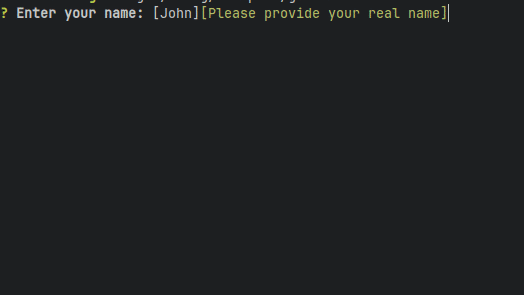

# Interactive CLI prompts in Rust

Create interactive input prompts like in [GitHub's CLI tool](https://cli.github.com/).



## Features

- Cross-platform;
- Only one dependency - [crossterm](https://github.com/crossterm-rs/crossterm);
- 4 prompts out of the box:
  - Normal input field. Supports input validation and default values;
  - Confirmation y/n;
  - Selection from the list of options;
  - Multiselection.
- Customization of the colors and text style of the prompts;
- Set of traits and helper structs that allows to implement custom prompts for your application;

## Getting started

More elaborate examples can be found in the [examples](examples) directory

```rust
    use cli_prompts::{
        prompts::{Input, AbortReason},
        DisplayPrompt
    }

    fn show_input_prompt() {
      let name : Result<String, AbortReason> = Input::new("Enter your name", name_validation)
          .default_value("John")
          .help_message("Please provide your real name")
          .display();

      match name {
          Ok(n) => println!("The name is {}", n),
          Err(abort_reason) => println!("Input was aborted because of {:?}", abort_reason),
      }
    }

    fn name_validation(name: &str) -> Result<String, String> {
      if name.len() > 0 {
          Ok(name.to_string())
      } else {
          Err("Name must not be empty".into())
      }
    }

```

## License
This project, cli_prompts is licensed under the MIT License - see the [LICENSE](LICENSE) file for details.
