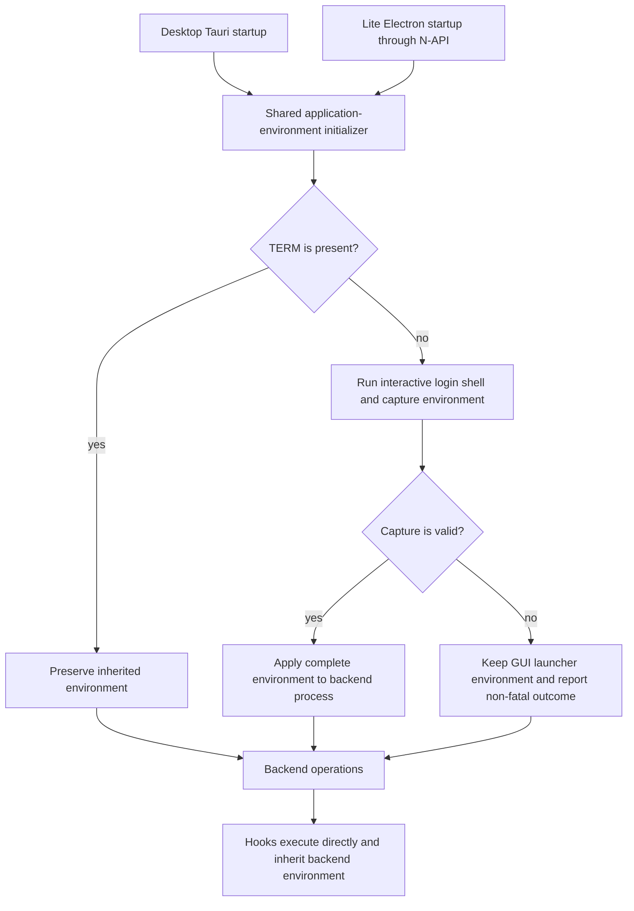

# GUI Hook Shell Environment - Plan

## Goal Capsule

- **Objective:** Hooks launched by GitButler Desktop and Lite can find tools configured in the user's global login-shell environment.
- **Means:** Initialize each GUI backend from one shared login-shell environment loader, then continue to execute hooks directly according to Git semantics (KTD1, KTD2).
- **Authority:** Product Requirements define observable behavior. Key Technical Decisions define the implementation mechanism.
- **Execution profile:** Code change spanning shared Rust infrastructure, the N-API surface, and both GUI startup paths.
- **Stop conditions:** Stop and revisit the plan if matching Desktop and Lite requires invoking a login shell per hook, if the environment cannot be initialized before backend operations, or if the generated N-API boundary cannot expose startup initialization without leaking environment values.
- **Tail ownership:** The implementation owner updates generated SDK artifacts and verifies both GUI startup paths.

---

## Product Contract

### Summary

GitButler Desktop and Lite will import the user's global login-shell environment during GUI startup.
Git hooks will retain direct executable and shebang behavior rather than running inside a new login shell.

### Problem Frame

Git hooks are executable programs and Git invokes them directly.
GitButler follows that behavior through `git2-hooks` for commit hooks and `gix::command` for pre-push hooks.
Direct execution means hooks inherit the backend process environment.

Desktop compensates for the limited environment supplied to GUI applications by importing `$SHELL -i -l -c env` during Tauri startup.
Lite loads the Rust N-API backend inside Electron without equivalent initialization.
When Lite starts from Finder, Dock, or another graphical launcher, hooks may not find tools whose paths are configured by shell startup files.

### Requirements

**Shared environment behavior**

- R1. A GUI-launched GitButler backend imports the user's interactive login-shell environment before any operation can launch a child process.
- R2. A backend launched from a terminal preserves its inherited environment without invoking another login shell.
- R3. Missing, invalid, or failing shell configuration does not prevent GitButler from starting and produces a diagnostic outcome suitable for application logs.
- R4. The environment initialization mechanism is shared by Desktop and Lite so both applications follow the same skip, success, and failure rules.

**Hook compatibility**

- R5. Commit and push hooks continue to execute directly so their executable path, shebang, arguments, stdin, output, and exit status retain current Git-compatible behavior.
- R6. Environment initialization occurs once at application startup rather than once per hook invocation.

### Key Decisions

- **Initialize global GUI environment, not project environments.** `(session-settled: user-approved — chosen over directory-specific activation because project environments require separate discovery, trust, and refresh semantics.)` This fix covers tools configured by global login-shell startup and defers directory-specific activation. Governs R1, R4, R6.
- **Preserve direct hook execution.** `(session-settled: user-approved — chosen over invoking a login shell for every hook because direct execution preserves Git semantics and hook shebangs.)` Hook shebangs remain authoritative and GitButler does not wrap each hook in the user's shell. Governs R5, R6.

### Acceptance Examples

- AE1. Given Lite starts without `TERM` and the login shell adds a tool directory to `PATH`, when a commit hook invokes a tool from that directory, then the tool is found.
- AE2. Given Desktop or Lite starts with `TERM` and an already configured `PATH`, when application initialization runs, then no login shell is launched and the inherited `PATH` remains unchanged.
- AE3. Given `SHELL` is absent, points to a missing executable, or exits unsuccessfully, when a GUI application starts, then startup continues and the initialization result is logged without partially applying output.
- AE4. Given a hook declares an interpreter in its shebang, when GitButler runs the hook after environment initialization, then that interpreter executes the hook without an additional login-shell wrapper.

### Scope Boundaries

#### Deferred to Follow-Up Work

- Project-specific environments from `direnv`, activated Python virtual environments, shell directory hooks, or similar current-directory mechanisms.
- Refreshing the imported environment while an application is already running.
- Changing `git2-hooks` or GitButler's pre-push runner to invoke hooks through a login shell.

### Success Criteria

- A packaged Lite application launched from a graphical session can run a hook that depends on a tool exposed only through global shell startup configuration.
- Desktop retains its current terminal-like subprocess environment after moving to the shared initializer.
- Hooks with explicit shebangs behave the same before and after the change.

---

## Planning Contract

### Key Technical Decisions

- KTD1. **Keep direct hook execution.** `(session-settled: user-approved — chosen over invoking a login shell for every hook: direct execution preserves Git semantics, hook shebangs, and startup performance.)` The implementation must not change the runners in `crates/gitbutler-repo/src/hooks.rs`.
- KTD2. **Centralize process environment initialization in Rust.** `(session-settled: user-approved — chosen over separate Desktop and Lite implementations: one shared initializer prevents the application startup paths from drifting.)` Move the skip, extraction, application, and diagnostic outcome rules into `but-core`; expose a lifecycle entry point through `but-api` for embedding applications.
- KTD3. **Keep environment data inside the native process boundary.** The lifecycle API applies the environment and returns only a non-sensitive outcome. It must not return the captured environment map through N-API or expose shell variables to a renderer.
- KTD4. **Treat initialization failure as non-fatal and atomic.** Capture and validate the complete shell output before changing the process environment. Apply no variables when the shell cannot launch, exits unsuccessfully, or yields no valid pairs.
- KTD5. **Preserve the existing terminal-launch guard.** Presence of `TERM` means the launcher already supplied the intended environment. This rule maintains Desktop behavior and prevents shell startup files from overriding an explicitly prepared terminal environment.

### High-Level Technical Design

The initializer owns environment acquisition and mutation.
Application entry points own when to invoke it and how to record its outcome.
Hook runners remain consumers of the resulting process environment.

### Sequencing

1. Establish deterministic shared environment behavior and tests in `but-core`.
2. Expose the startup lifecycle operation through `but-api` and migrate Desktop to it.
3. Invoke the operation from Lite before other backend initialization and regenerate the Node SDK.
4. Add hook-level regression coverage and packaged-application smoke verification.

### System-Wide Impact

- **Subprocesses:** The imported environment affects all child processes launched by Lite, including Git, hooks, editors, terminals, and credential helpers. This matches existing Desktop behavior.
- **Startup:** A GUI launch may wait for shell startup on Unix. Lite must complete initialization before backend APIs become available. Existing Windows non-blocking behavior must not regress.
- **Security:** Login-shell startup files are user-controlled code. Desktop already executes them. Lite will gain the same behavior, and logs must never include captured environment values.
- **API surface:** The generated Node SDK gains an application lifecycle operation. It is for Electron's main process and other trusted embedders, not renderer exposure.

### Risks and Mitigations

- **Slow or interactive shell startup:** Suppress shell stderr and preserve the existing platform scheduling behavior. Record elapsed-time diagnostics without logging environment contents if existing tracing conventions support it.
- **Concurrent environment access:** Invoke initialization at the earliest application lifecycle point and document that callers must complete it before backend operations or child-process creation.
- **Partial or malformed output:** Parse into a temporary collection and reject an empty or unsuccessful capture before applying variables.
- **Test contamination from process-global variables:** Keep parser and decision tests pure where possible. Use a subprocess for tests that mutate the environment.
- **Generated API drift:** Regenerate both graph and linear SDK outputs from the API source rather than editing generated bindings by hand.

### Sources and Research

- `crates/but-core/src/cmd.rs` contains the current login-shell extraction and environment parser.
- `crates/gitbutler-tauri/src/main.rs` contains Desktop's startup guard, application of captured variables, logging, and Windows scheduling.
- `apps/lite/electron/src/main.ts` initializes the application namespace and askpass after Electron becomes ready but has no environment initialization.
- `crates/but-api/src/platform.rs` owns lifecycle APIs for applications embedding the backend.
- `crates/gitbutler-repo/src/hooks.rs` demonstrates that commit hooks and pre-push hooks execute directly.
- `crates/gitbutler-branch-actions/tests/branch-actions/hooks.rs` owns end-to-end commit-hook behavior.
- Git's `githooks` contract treats hooks as executable programs. Upstream `git2-hooks` adopted direct Unix execution in gitui-org/gitui#2483.

---

## Implementation Units

### U1. Shared application environment initializer

- **Goal:** Make login-shell environment initialization a deterministic, reusable startup capability.
- **Requirements:** R1, R2, R3, R4, R6
- **Dependencies:** None
- **Files:**
  - `crates/but-core/src/cmd.rs`
  - `crates/but-core/tests/core/cmd.rs`
- **Approach:**
  1. Separate shell invocation, output parsing, initialization policy, and process mutation so deterministic behavior can be tested without relying on the developer's real shell.
  2. Add a public startup initializer that preserves the `TERM` guard, captures `$SHELL -i -l -c env`, validates process success and parsed output, then applies the environment according to KTD3-KTD5.
  3. Return a small outcome that distinguishes inherited terminal environment, imported login environment, and non-fatal unavailability without including variable names or values.
  4. Keep the existing byte-preserving parser internally where supported. Do not narrow environment values to UTF-8 merely for the N-API caller.
- **Execution note:** Add deterministic characterization coverage before moving the existing Tauri behavior.
- **Patterns to follow:** Existing `gix::command::prepare` invocation and `tracing` instrumentation in `crates/but-core/src/cmd.rs`.
- **Test scenarios:**
  - Covers AE2. Supply a present terminal marker and assert the shell launcher is not called and the inherited environment is not changed.
  - Supply a fake shell that exits successfully with multiple key-value pairs, including a value containing `=`, and assert the complete parsed set is applied.
  - Covers AE3. Supply no shell path and assert a non-fatal unavailable outcome with no environment mutation.
  - Covers AE3. Supply a missing or non-zero shell and assert output is not partially applied.
  - Supply successful shell output with no valid pairs and assert it is rejected without mutation.
  - Run mutation-sensitive coverage in an isolated subprocess so parallel tests cannot observe temporary process variables.
- **Verification:** The shared initializer has deterministic success, skip, malformed-output, and failure coverage and no test depends on the user's actual shell configuration.

### U2. Shared lifecycle API and Desktop migration

- **Goal:** Give trusted application entry points one API for environment initialization and move Desktop to it without behavior loss.
- **Requirements:** R1, R2, R3, R4, R6
- **Dependencies:** U1
- **Files:**
  - `crates/but-api/src/platform.rs`
  - `crates/gitbutler-tauri/src/main.rs`
- **Approach:**
  1. Add a documented application lifecycle API beside `init_application_namespace` that invokes the shared initializer and exposes only its outcome.
  2. Replace Desktop's local extraction and mutation loop with the lifecycle API while preserving current log messages, early startup placement, and Windows scheduling.
  3. Remove application-local environment mutation code once the shared API owns it.
- **Patterns to follow:** `init_application_namespace` in `crates/but-api/src/platform.rs` and Tauri setup ordering in `crates/gitbutler-tauri/src/main.rs`.
- **Test scenarios:**
  - Call the lifecycle API with terminal-launch conditions and assert it reports preservation rather than importing a shell environment.
  - Call the lifecycle API with an unavailable shell and assert the API succeeds with a non-fatal outcome.
  - Verify the outcome serialized for N-API contains status metadata only and no captured environment entries.
- **Verification:** Desktop compiles against the shared API, retains its initialization order, and no longer owns a duplicate environment application loop.

### U3. Initialize Lite before backend use

- **Goal:** Give Lite the same global shell environment behavior as Desktop.
- **Requirements:** R1, R2, R3, R4, R6
- **Dependencies:** U2
- **Files:**
  - `apps/lite/electron/src/main.ts`
  - `packages/but-sdk/src/generated/graph/index.d.ts`
  - `packages/but-sdk/src/generated/graph/index.js`
  - `packages/but-sdk/src/generated/graph/apiParamNames.d.ts`
  - `packages/but-sdk/src/generated/graph/apiParamNames.js`
  - `packages/but-sdk/src/generated/linear/index.d.ts`
  - `packages/but-sdk/src/generated/linear/index.js`
  - `packages/but-sdk/src/generated/linear/apiParamNames.d.ts`
  - `packages/but-sdk/src/generated/linear/apiParamNames.js`
- **Approach:**
  1. Regenerate the SDK so Electron can call the lifecycle API through the native binding.
  2. Await environment initialization at the start of Lite's ready callback before settings, credential namespace, askpass, watcher, or window setup can invoke backend operations.
  3. Log the status without logging environment names or values. Continue startup for skipped and unavailable outcomes.
- **Patterns to follow:** The existing awaited `initApplicationNamespace` lifecycle call and startup ordering in `apps/lite/electron/src/main.ts`.
- **Test scenarios:**
  - Cover AE1 at the native lifecycle boundary with a controlled shell whose environment adds a fixture executable, then assert a backend-launched child process can find it.
  - Cover AE2 at the native lifecycle boundary with `TERM` and a sentinel `PATH`, then assert initialization preserves that path.
  - Covers AE3. Start Lite with an invalid shell path and assert the main window still becomes ready.
  - Assert from the main-process startup sequence that environment initialization is awaited before application namespace and askpass initialization.
- **Verification:** Lite type-checks against generated bindings, starts after each initialization outcome, and exposes no shell environment to renderer IPC.

### U4. Hook inheritance regression coverage

- **Goal:** Prove imported startup environment reaches hooks without changing hook execution semantics.
- **Requirements:** R1, R5, R6
- **Dependencies:** U1, U2, U3
- **Files:**
  - `crates/gitbutler-branch-actions/tests/branch-actions/hooks.rs`
  - `crates/gitbutler-repo/tests/repo/hooks.rs`
  - `apps/lite/e2e/setup.ts`
  - `apps/lite/e2e/tests/start.spec.ts`
- **Approach:**
  1. Extend the existing hook suites instead of creating a second hook harness.
  2. Use a subprocess or controlled application environment to initialize a fixture-only executable path before running a hook.
  3. Assert that commit and pre-push hooks inherit the executable path while retaining their current shebang, arguments, stdin, output, and exit behavior.
  4. Add Lite E2E coverage for the non-fatal startup path with an invalid shell. Reserve the real GUI-launch hook check for packaged manual verification because the existing startup E2E has no hook-execution surface.
- **Execution note:** Start with a failing integration test that demonstrates a GUI-style environment cannot currently resolve the fixture executable.
- **Patterns to follow:** `write_hook` and rejection/message tests in `crates/gitbutler-branch-actions/tests/branch-actions/hooks.rs`; pre-push stdin assertions in `crates/gitbutler-repo/tests/repo/hooks.rs`; isolated environment creation in `apps/lite/e2e/setup.ts`.
- **Test scenarios:**
  - Covers AE1. A commit hook resolves and runs an executable present only in the imported login-shell `PATH`.
  - A pre-push hook resolves the same executable and still receives remote arguments and ref updates on stdin.
  - Covers AE4. A hook with a controlled non-default shebang records its interpreter, proving no user-shell wrapper replaced it.
  - A failing hook still reports its original stdout, stderr, and exit status after environment initialization.
  - A Lite GUI-style launch with an invalid shell reaches ready state and reports the unavailable outcome without exposing environment contents.
- **Verification:** Hook regression tests demonstrate both environment inheritance and unchanged direct-execution behavior.

---

## Verification Contract

| Scope                | Command                                                                                   | Covers     | Done signal                                                                                      |
| -------------------- | ----------------------------------------------------------------------------------------- | ---------- | ------------------------------------------------------------------------------------------------ |
| Shared Rust behavior | `cargo test -p but-core`                                                                  | U1         | Deterministic initializer and parser scenarios pass.                                             |
| Hook integration     | `cargo test -p gitbutler-branch-actions hooks` and `cargo test -p gitbutler-repo hooks`   | U4         | Commit and pre-push inheritance tests pass.                                                      |
| Rust API integration | `cargo check -p but-api --all-targets` and `cargo check -p gitbutler-tauri --all-targets` | U2         | Shared API and Desktop compile on supported targets.                                             |
| Generated SDK        | `pnpm build:sdk && pnpm format`                                                           | U2, U3     | Generated graph and linear bindings contain the lifecycle API and generated output is formatted. |
| Lite static checks   | `pnpm -F @gitbutler/lite check`                                                           | U3         | Electron consumes the generated API without type errors.                                         |
| Lite behavior        | `pnpm -F @gitbutler/lite test` and `pnpm -F @gitbutler/lite test:e2e`                     | U3, U4     | Startup ordering and non-fatal shell failure paths pass.                                         |
| Rust formatting      | `cargo fmt`                                                                               | U1, U2, U4 | Intended Rust files are formatted with no unrelated changes.                                     |

Manual packaged verification is required on macOS: launch Lite from Finder or Dock with a fixture tool configured only by login-shell startup, then run a hook that invokes the tool.
Repeat from a terminal with a prepared `PATH` to confirm the inherited environment is preserved.

---

## Definition of Done

- R1-R6 are implemented and covered by the stated unit or integration scenarios.
- Desktop and Lite invoke the same native environment initialization policy before backend child processes can start.
- Lite can run a hook that depends on a globally shell-configured executable when launched graphically.
- Hooks remain directly executed and existing argument, stdin, output, exit-status, and shebang tests continue to pass.
- Missing or failing shell configuration leaves both applications usable and produces diagnostics without environment contents.
- Generated SDK files match the source API and Lite passes its static checks.
- The packaged macOS smoke test passes for graphical and terminal launches.
- No per-project environment activation, abandoned experimental runner, or duplicate application-specific initializer remains in the change.
